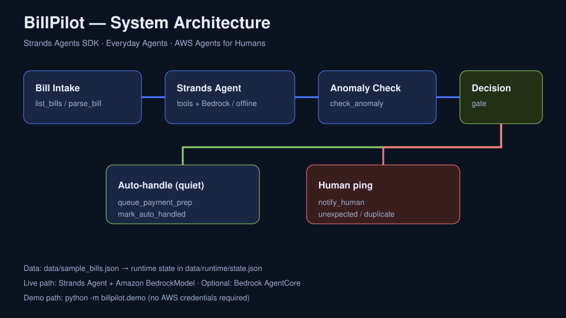

# BillPilot Architecture

BillPilot is an **Everyday Agent** for the AWS Agents for Humans hackathon, built with the [Strands Agents SDK](https://strandsagents.com/).

## Product contract

**Do the bill busywork. Interrupt humans only when a real decision is required.**

That contract is enforced by the anomaly → decision gate path, not left to prompt hope.

## Diagram

## Components

1. **Intake layer** — `list_bills` / `parse_bill` normalize due bills from fixtures (swap for email/PDF/bank connectors in production).
2. **Strands tool surface** — six `@tool` functions share one state store under `data/runtime/`.
3. **Anomaly analysis** — `check_anomaly` flags:
   - amount outside `expected_amount_range`
   - duplicate payee + amount + due date
4. **Decision gate**
   - safe → `queue_payment_prep` + `mark_auto_handled`
   - risky → `notify_human(reason, recommended_action)`
5. **Model layer**
   - **Offline / judges:** deterministic pipeline invoking the same tools (zero AWS keys)
   - **Live:** Strands `Agent` + `BedrockModel` (Amazon Bedrock)
   - **Stretch:** Amazon Bedrock AgentCore deployment (boosts Technical Implementation)

## Why this is non-trivial

- Multi-step tool orchestration with persistent state
- Explicit human-in-the-loop boundary matching the hackathon brief
- Dual-path demo: offline proof for judges + Bedrock path for production fidelity

## Security / privacy notes

Demo uses local fixtures only. A production deployment should keep bill PII in a vaulted store, minimize what the model sees, and require confirmation on any payment initiation above a user-set threshold.
